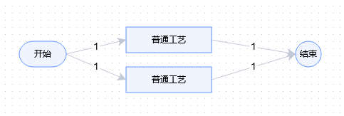

# FlowVision 可视化规则引擎

本开源库包括`FlowVision可视化规则引擎`核心算法。不包含编辑程序完整源码。

    `csharp` 规则引擎核心算法 C#语言实现
    `java` 规则引擎核心算法 JAVA语言实现
    `g4` 计算规则，Antlr4语法
    `doc` 说明文档、案例实现
    `TestScript` 测试脚本，用于检测设计是否有问题
    设计程序下载：https://pan.baidu.com/s/138R4d172-drb731GoTI6Vg?pwd=92i2
  

## 规则引擎适用场景
- 商品价格计算
- 任务分配规则
- 申请规则

## 可视化规则引擎优势
- 业务规则与系统代码分离，避免升级的风险；
- 加强业务处理的透明度，实现业务规则的集中管理；
- 提高业务灵活性，在不重启服务的情况下可随时对业务规则进行扩展和维护；
- 规则引擎是相对独立的，业务分析人员可以参与编辑、维护系统的业务规则，减少对IT人员的依赖程度；
- 简化系统架构，优化应用，方便系统的整合；
- 减少了程序使用“硬编码”业务规则的成本和风险；
- **可视化编辑是一张思维导图，每个节点都能有下一个节点，并且节点上都有条件公式，这样就成了一个完整规则。普通人都看懂各个节点的关系，学习成本低，对新人培训非常友好；**
- 可以导出图片，方便与业务人员进行沟通交流；
- **复原计算过程，业务人员自己可以查找问题所在，避免开发人员成为客服的工具人;**
- 倒推生产数量，满足制造业特殊需求；
- 使用EXCEL函数，降低财务人员学习成本。

## 快速上手
### 1、下载程序
下载地址：https://pan.baidu.com/s/138R4d172-drb731GoTI6Vg?pwd=92i2

注：免费使用，高级功能订阅
### 2、使用管理员账号登录管理后台
    网址：http://localhost:5000/Members/login
	管理员账号：admin 密码：admin
	开发账号：developer 密码：developer
	只读账号：reader密码：reader
### 3、在顶部【项目管理】->左侧菜单栏【流程设计】->【流程信息】页面点击【新增流程】
	编码：Flow
	名称：流程一
### 4、【流程信息】页面双击【流程一】，进行编辑
    
双击顶部的【普通工艺】，编辑

	标签：数量<100总价
	检测条件：数量<100
    配置公式：
        变量名称：总价
        默认公式：数量*10
双击底部的【普通工艺】，编辑

	标签：数量>=100总价
	检测条件（可不写）：数量>=100
    配置公式：
        变量名称：总价
        默认公式：数量*8
注：计算顺序，从左到右，从上到下。必须有【开始】【结束】，【项目列表】可取消【数量】必填。

### 5、在顶部【项目管理】->左侧菜单栏【流程设计】->【流程信息】页面点击【生成项目】
选择【生成项目文件并更新缓存】，生成完毕后关闭
### 6、进入前台【计算公式】
    厂区：默认
    流程：流程一
    参数：{"数量":"1000"}
    公式：总价
点击【提交】，返回：
``` json
{"code":1,"data":{"result":"8000"},"state":"SUCCESS","message":"SUCCESS","status":["END"]}
```

## 类库使用
``` cs
    // 使用的是快速上手 案例 生成导出的文件
    var text = File.ReadAllText("dict/项目_20221207133837.json");
    var project = ProjectWork.ParseJson(text);
    FlowEngine flowEngine = new FlowEngine(project);
    flowEngine.BuildTreeNode("Flow", "Project1", "{\"数量\":800}");
    flowEngine.EvaluateInputNum();
    var t = flowEngine.TryEvaluate("总价", 0);


    var fileBytes = File.ReadAllBytes("dict/项目_20221207133841.data");
    var project2 = ProjectWork.ParseJsonWithRsa(fileBytes);
    FlowEngine flowEngine2 = new FlowEngine(project2);
    flowEngine2.BuildTreeNode("Flow", "Project1", "{\"数量\":80}");
    flowEngine2.EvaluateInputNum();
    var t2 = flowEngine2.TryEvaluate("总价", 0);
```

## 特别声明
源码为GPL-3.0 许可，商业请购买商业许可，商业授权费1000元

购买步骤：

1、进入面包多购买 https://mbd.pub/o/bread/ZJiWmpty

2、将公司名称、组织机构代码、授权码、面包多订单号发送给我。
-    a) 邮件发送至toolgood@qq.com
-    b) 加我QQ1665690808

商业授权名单：https://github.com/toolgood/ToolGood.TextFilter/issues/3


开票说明：
- 金额超过1000元，可开票。
-    面包多上其他产品，需提供购买截图。


## FlowVision交流群
    Q群：728043258