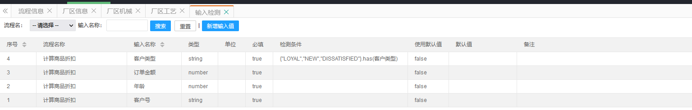
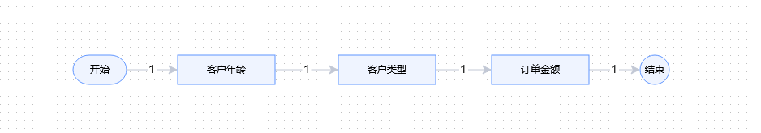
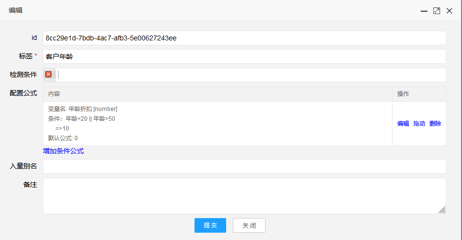
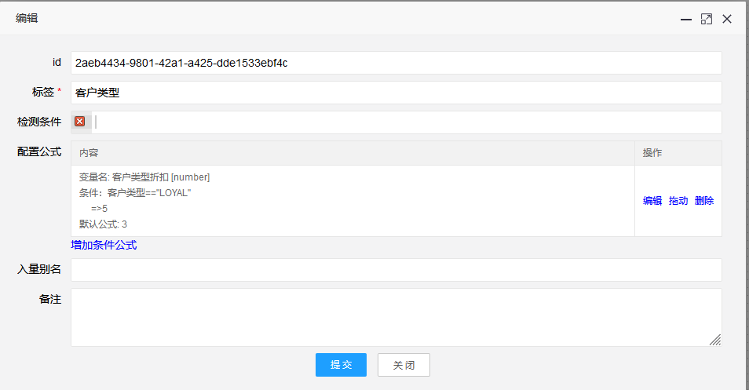
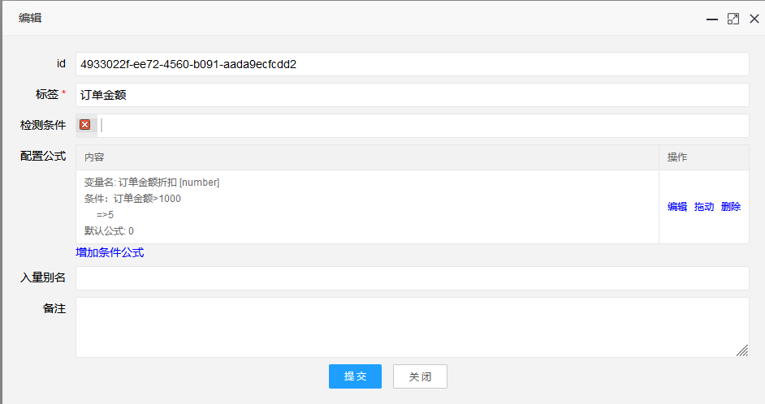
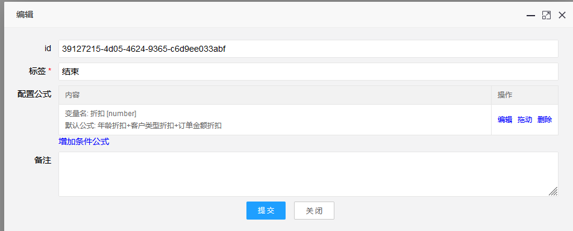
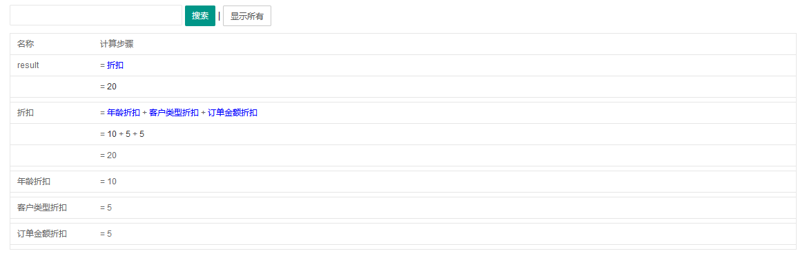

# 案例一：计算商品折扣

来源：https://www.cnblogs.com/alvinscript/p/17205498.html

## 案例分析
输入分析：
- 客户号：文本
- 年龄：数字
- 订单金额：数字
- 客户类型：枚举，LOYAL, NEW, DISSATISFIED

返回数据
- 折扣： 真实价格=价格*(1-折扣/100.0)

规则分析
- 规则1：当客户年龄在20岁以下或者50岁以上，添加10%的折扣
- 规则2：客户类型是LOYAL，增加5%的折扣
- 规则3：客户类型不是LOYAL，增加3%的折扣
- 规则4：订单金额>1000时，增加5%的折扣

----

规则简化：
- 规则1：当客户年龄在20岁以下或者50岁以上，添加10%的折扣
- 规则2：客户类型是LOYAL，增加5%的折扣，客户类型不是LOYAL，增加3%的折扣
- 规则3：订单金额>1000时，增加5%的折扣

## 项目实战
### 1、启动FlowVision-Windows.exe，进入后台
管理员账号：admin 密码：admin
 
### 2、在顶部【项目管理】->左侧菜单栏【厂区管理】-> 【厂区信息】页面点击【新增厂区】
    分类：项目一
    编码：Project1
    简称：项目一
### 3、在顶部【项目管理】->左侧菜单栏【流程设计】->【流程信息】页面点击【新增流程】
    编码：Flow
    名称：计算商品折扣
### 4、在顶部【项目管理】->左侧菜单栏【流程设计】->【流程信息】页面点击【输入检测】
点击【新增输入值】，增加以下几项
- 输入项：客户号，输入类型：文本
- 输入项：年龄，输入类型：数字
- 输入项：订单金额，输入类型：数字
- 输入项：客户类型，输入类型：文本，检查输入：{"LOYAL","NEW","DISSATISFIED"}.has(客户类型)
    

### 5、进入【流程信息】，双击【计算商品折扣】进入设计
拖进【开始】、3个【跳过工艺】、【结束】，改名后，用线连接起来。
   
**注：未涉及工厂项目请使用【跳过工艺】，不要使用【工艺】**

### 6、配置条件
   
   
   
   
**注：注意自己的【输入值】名称，注意字符串是有引号的**

### 7、在顶部【项目管理】->左侧菜单栏【流程设计】->【流程信息】页面点击【生成项目】
选择【生成项目文件并更新缓存】，生成完毕后关闭】

### 8、进入前台【计算公式】
    厂区：项目一
    流程：流程一
    参数：{"客户号":"11","年龄":"8","订单金额":"1250","客户类型":"LOYAL"}
    公式：折扣
点击【提交】，返回：
``` json
{"code":1,"data":{"result":"20"},"state":"SUCCESS","message":"SUCCESS","status":["END"]}
```
### 9、进入前台【公式步骤】
点击【提交】
   
