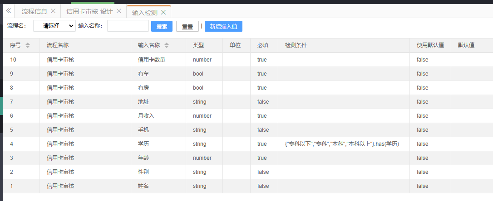
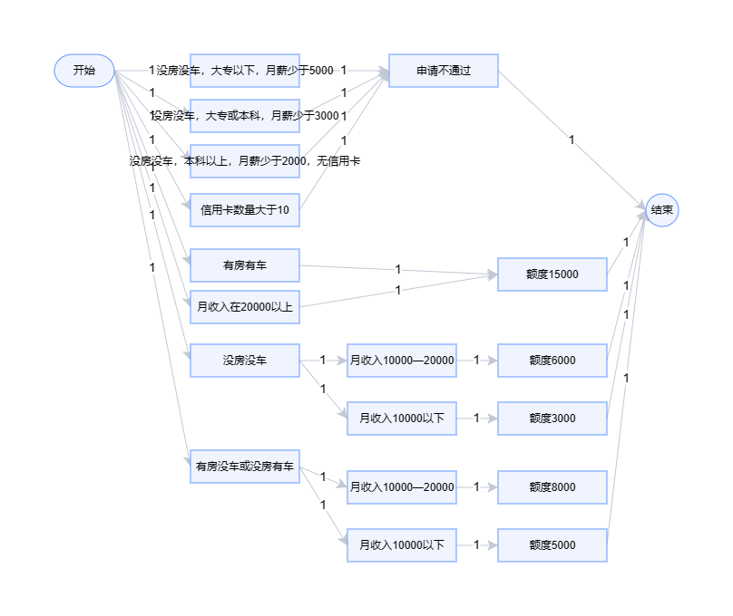
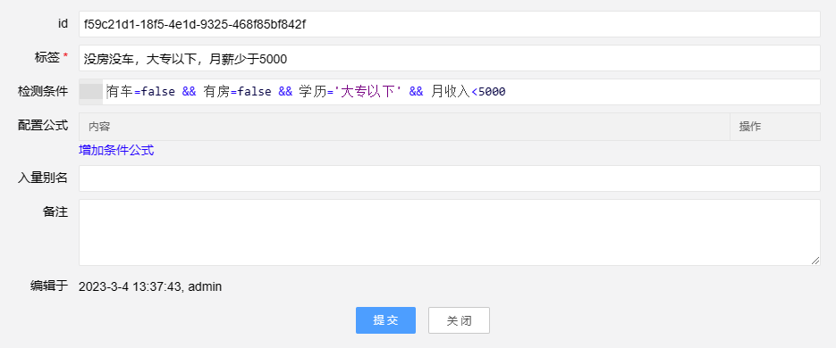
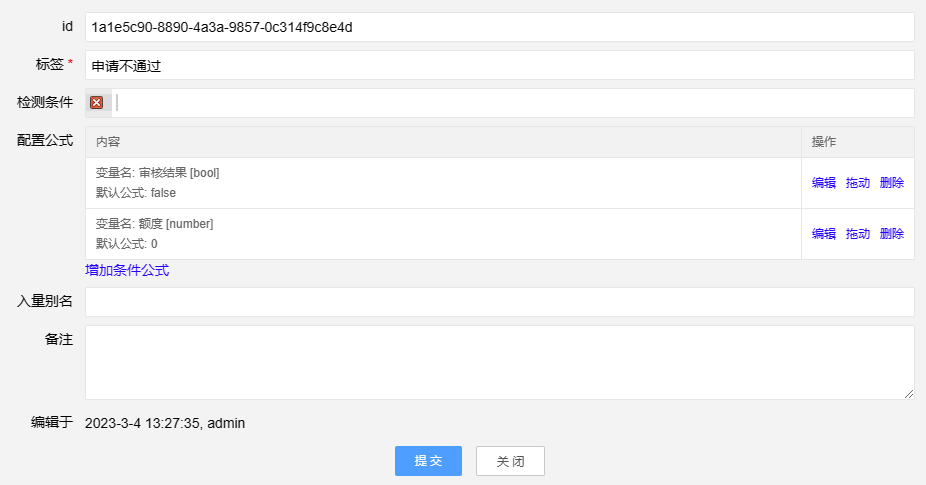

# 案例二：信用卡审核

来源：https://zhuanlan.zhihu.com/p/326419830

## 案例分析
输入分析：
- 姓名：文本
- 性别：文本
- 年龄：数字
- 学历：枚举，专科以下,专科,本科,本科以上
- 手机：文本
- 月收入：数字
- 地址：文本
- 有房：bool
- 有车：bool
- 信用卡数量：bool

返回数据
- 审核结果：bool，是否通过
- 额度：数字

规则分析
- 如果申请人既没房也没车，同时学历大专以下，月薪少于5000，申请不通过
- 如果申请人既没房也没车，同时学历大专或本科，月薪少于3000，申请不通过
- 如果申请人既没房也没车，同时学历本科以上，月薪少于2000，同时之前没有过信用卡，申请不通过
- 申请人现有信用卡数量大于10，申请不通过
- 如果申请人有房有车，或者月收入在20000以上，发放信用卡的额度是15000
- 如果申请人没房没车，但月收入在10000—20000之间，发放信用卡的额度是6000
- 如果申请人没房没车，但月收入在10000以下，发放信用卡的额度是3000
- 如果申请人有房没车或者没房有车，但月收入在10000以下，发放信用卡的额度是5000
- 如果申请人有房没车或者没房有车，但月收入在10000—20000之间，发放信用卡的额度是8000

## 项目实战
### 1、启动FlowVision-Windows.exe，进入后台
管理员账号：admin 密码：admin
 
### 2、在顶部【项目管理】->左侧菜单栏【流程设计】->【流程信息】页面点击【新增流程】
    编码：Flow
    名称：信用卡审核
### 3、在顶部【项目管理】->左侧菜单栏【流程设计】->【流程信息】页面点击【输入检测】
点击【新增输入值】，增加以下几项
- 输入项：姓名，输入类型：文本
- 输入项：性别，输入类型：文本
- 输入项：年龄，输入类型：数字
- 输入项：学历，输入类型：文本，检查输入：{"专科以下","专科","本科","本科以上"}.has(学历)
- 输入项：手机，输入类型：文本
- 输入项：月收入，输入类型：数字
- 输入项：地址，输入类型：文本
- 输入项：有房，输入类型：布尔值
- 输入项：有车，输入类型：布尔值
- 输入项：信用卡数量，输入类型：数字
 

### 4、进入【流程信息】，双击【计算商品折扣】进入设计
拖进【开始】、14个【普通工艺】、【结束】，改名后，用线连接起来。
   

### 5、配置条件
   
   
内容过于简单，略
 

### 6、在顶部【项目管理】->左侧菜单栏【流程设计】->【流程信息】页面点击【生成项目】
选择【生成项目文件并更新缓存】，生成完毕后关闭】


### 7、进入前台【计算公式】
    厂区：默认
    流程：信用卡审核
    参数：{"姓名":"12312","性别":"123","年龄":"20","学历":"本科","手机":"123","月收入":"2000","地址":"123","有房":"false","有车":"false","信用卡数量":"1"}
    公式：[{name:'审核结果',formula:'审核结果'},{name:'额度',formula:'额度'}]
点击【提交】，返回：
``` json
{"code":1,"data":{"审核结果":"FALSE","额度":"0"},"state":"SUCCESS","message":"SUCCESS","status":["END"]}
```

